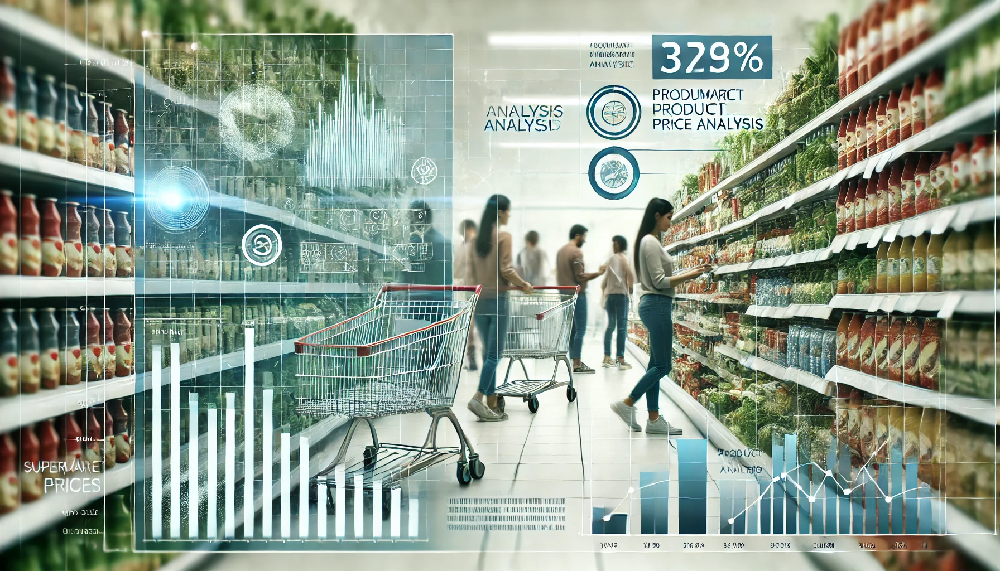

# 📊 Basket price analysis
<div style="text-align: center;">
  
</div>

## 📝 Project Overview

The purpose of this project is the basket supermarket product price analysis comparison. 

The goal is to extract, through scraping techniques, historical data of supermarket product prices, divided by different supermarket chains, from three main categories of products: Milk, olive oil and sunflower oil. Then, complete the ETL process with a transformation of the extracted data, to then load it into a PostgreSQL database.

Finally, conduct a price review for products accross supermakets to make recommendations.

The main source used for this extraction will be [FACUA](https://super.facua.org/). 


## 📁 Project Structure
```bash
project_name/
├── assets/                            # Asset files (e.g., images, other resources)
├── data/
│   └── extracted/                     # Extracted data files
│       ├── facua_extracted_auto.csv
│       └── facua_extracted.csv
├── notebooks/                         # Jupyter notebooks for various stages
│   ├── 1_data_extraction.ipynb
│   ├── 2_data_transformation.ipynb
│   ├── 3_data_load.ipynb
│   └── 4_data_analysis.ipynb
├── src/                               # Source code for project scripts
│   ├── data_etl.py
│   └── support/                       # Supporting modules for each process
│       ├── data_extraction_support.py
│       ├── data_load_support.py
│       ├── data_transformation_support.py
│       ├── data_visualization_support.py
│       └── database_connection.py
├── Pipfile                            # Dependency management file
├── Pipfile.lock                       # Lockfile for exact versions of dependencies
└── README.md                          # Project documentation

```
[Response #23]

## 🛠️ Installation and Requirements
This project requires the following tools and libraries:

- Python 3.11+
- matplotlib
- seaborn
- pandas
- numpy
- beautifulsoup4
- ipykernel
- psycopg2 (version 2.9.9)
- requests
- psycopg2-binary (version 2.9.9)
- python-dotenv
- tqdm
- unidecode
- scipy

**Documentation Links:**  
- [Pipenv Documentation](https://pipenv.pypa.io/en/latest/)  
- [Matplotlib Documentation](https://matplotlib.org/)  
- [Seaborn Documentation](https://seaborn.pydata.org/)  
- [Pandas Documentation](https://pandas.pydata.org/)  
- [NumPy Documentation](https://numpy.org/)  
- [BeautifulSoup Documentation](https://www.crummy.com/software/BeautifulSoup/bs4/doc/)  
- [Psycopg2 Documentation](https://www.psycopg.org/docs/)  
- [Requests Documentation](https://docs.python-requests.org/)  
- [Python-dotenv Documentation](https://saurabh-kumar.com/python-dotenv/)  
- [TQDM Documentation](https://tqdm.github.io/)  
- [Unidecode Documentation](https://pypi.org/project/Unidecode/)  
- [Scipy Documentation](https://docs.scipy.org/doc/scipy/)  

#### Setting up the Environment with Pipenv

Clone this repository by navigating to the desired folder in your command line and cloning the environment:
```bash
git clone https://github.com/MiguelLoopezVirues/basket-price-analysis
```

To replicate the project's environment, you can use Pipenv with the included `Pipfile.lock`:
```bash
pipenv install
pipenv shell  
```

Alternatively, install the dependencies from `requirements.txt`:
```bash
pip install -r requirements.txt  
```

## 📊 Results and Conclusions
Check the `4_data_analysis.ipynb` notebook (located in `notebooks/4_data_analysis.ipynb`) for conclusions and recommendations.

## 🔄 Next Steps

- Perform ETL process through asynchronicity
- Look into dia's rise in average aceite de girasol price for all brands vs white label
- Dive deeper into the analysis of different subcategories

## 🤝 Contributions
Contributions are welcome. If you wish to improve the project, open a pull request or an issue.

## ✒️ Authors
Miguel López Virués - [GitHub Profile](https://github.com/MiguelLopezVirues)  


## 📜 License

This project is licensed under the MIT License.
